  # My Mind

  Hello Professor Subasic (and esteemed TA's). Welcome to My Mind

  My Mind is a minimalistically-aesthetic maximally-productive Web App created by yours truly with assistance from Figma Make, all outlined in the Process Documentation below. You can run the code as shown here, and you can see the additional resources at these links:

  ## Links and co.

    ###Web App Link: https://my-mind.figma.site/
  ###Figma Make: https://www.figma.com/design/nRl6SrrIRORrDZHCir9BKZ/My-Mind.
  ###GitHub Repository: https://github.com/Hayooota/MyMind
  ###Loom Video: https://www.loom.com/share/4c12baa69bf846acb8541851b7287cc7
    
  ## Process Documentation

  My Mind is a To-Do List Web App created using React (TypeScript) and Supabase. It was designed by me and developed using Figma's Make, according to this timeline.

  ### Ideation and Design
  First of all, I started by reading the assignment instructions in full, detailing of what I should include, and well as noting down what I could include, as seen here:

  Then, I took to Pinterest and Behance to gain a perception on how the app would function, and inspiration as to how the app would look like, funneling all the ideas into these three designs:

  After that, I took pen to paper and designed what I wanted the To-Do List app to be; from the designs I saw and from already-existing products, I noted that none of them work for me because they are overly complex and way too flash... none of them except Notion. I admire Notion's minimalist nature because it makes you focus on productivity, leaving the aesthetic to them. This is exactly what I wanted my app to emulate, and so I came up with this design:

  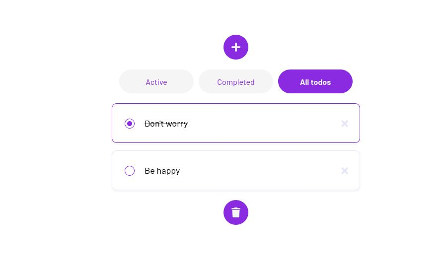
  
  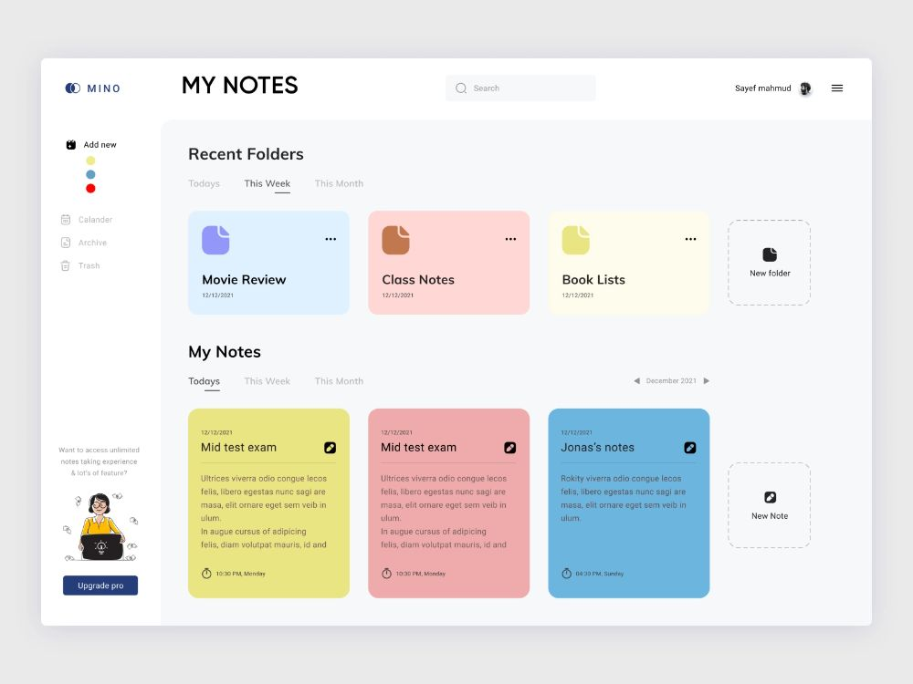
  
  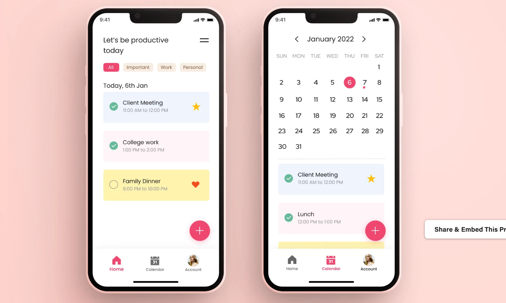

  For the last part of the ideation and design, I engineered an initial prompt that I fed into Figma Make to generate a preliminary product, that being the following:

  'Okay so, I'm making a to-do web app using React, Flask and SQLAlchemy called My Mind that like this:  As soon as you enter the app it is an empty, off-white page with a header in the top 10% of the page with a faded brownish-black magnifiying glass on the ultra left (with some margin) and an addition symbol on the ultra right (with some margin) and lastly, in the dead center, also in faded black-brown are the words My Mind. Now, when you click on the addition symbol, first of all is turns and becomes an x, and in doing so replaces the My Mind title with an input for the name of our to do item, which after you press enter creates a rectangle with rounded edges and the name of the task in the middle of the page below the header, also in the color of the one selected from the palette that opened after the person clicked on plus, that closes with it; these colors are the pallette of notion, an image of which I will supply you with later. Okay so now we've established how the app works, just a few more details: you can check off a task by clicking the faded translucent check to the left of it's title - or you can nestle a sub task into it, by clicking the faded translucent plus symbol, which adds a lighter colored, smaller width rounded rectangle in the first one, that has the exact same properties - check or plus. Lastly, each of these large task items has a maximum sub-task level of 3, for aesthetic value - and you can hide subtasks of a certain task or subtask by double clicking on it - lastly, you can drag and drop these tasks anywhere within My Minds one page, even if you drag it for so long it goes out of the camera view, the task will go beyond it, kinda like figma's figjam page, and additionally you can drag subtasks from one task/subtask to another. Capeech?'

  ### Development and Editing

  This prompt created an app that can be found in the GitHub under Version 0.0, and looked like this:

  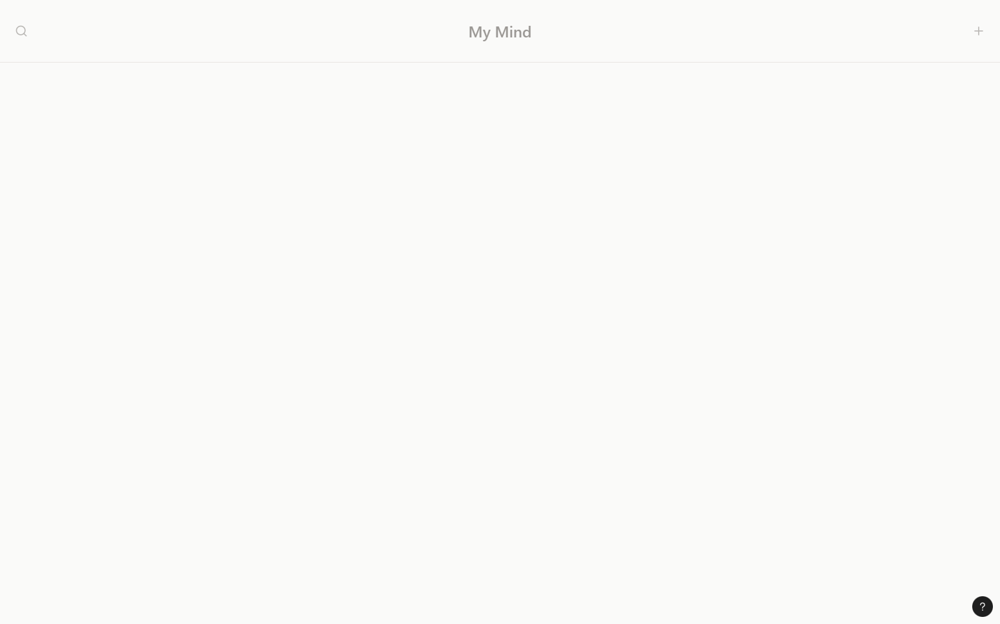

  It functioned extremely well for the very first prompt, I was shocked honestly, as a not-really AI user. However, the drag-and-drop function wasn't as fluid as I wanted it to be, so I inputted the following promt: 'It is absolutely PERFECT!!! The only thing I would like you to change is that the drag and drop is very sticky and not fluid'. Which gave me this version found under Version 0.1, and looked like this:
  
  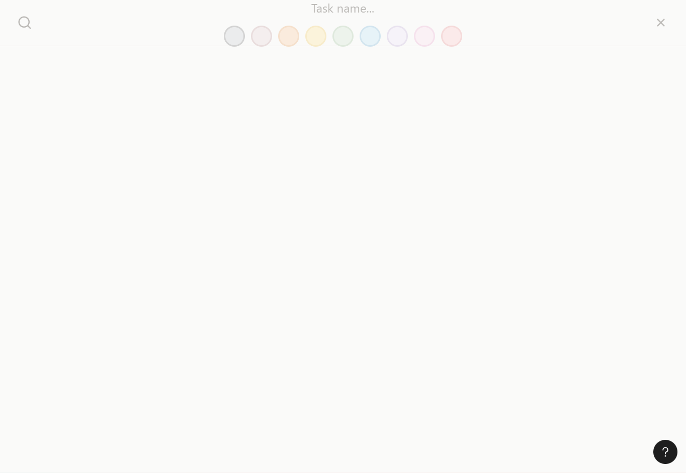

  Which was great, except that the sub-tasks were always the default color, blue, while I wanted them to be the same as their parent task, for cohesiveness of view. So, I asked Make to 'Now can you make each subtask have the same color as it's main task, just a little lighter', this new version named Version 0.2, and it looked like:

  

  Again, great, but after trying it out, still needed some tweaks, both aesthetically and productively. Therefore, I inputted 'Perfect, now the search button, make it centralize the task/subtask that matches the search the most, with the search bar being just like the naming technique, with the My mind being it', which gave me Version 0.3, and was as so:

  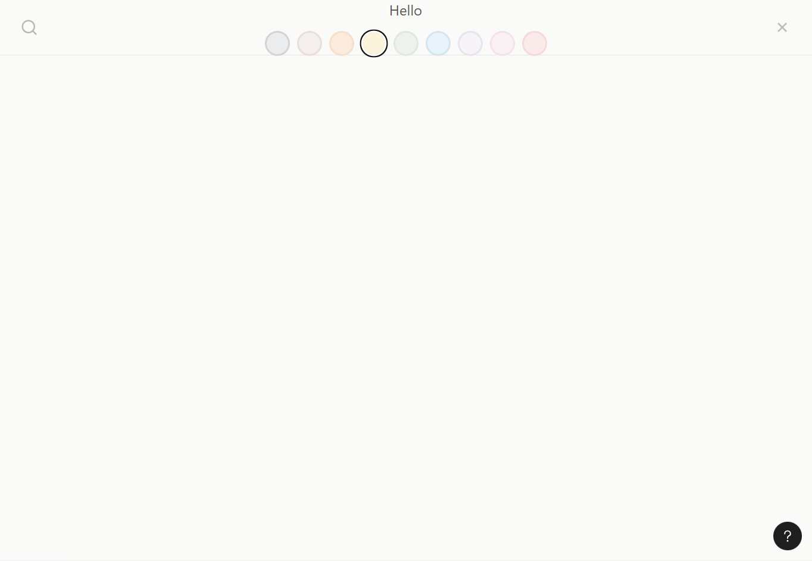
  
  Amazing!! as you can see, but it could be better, especially since we can add tasks, but we can't delete them. So, after 'Now make a little faded trash icon at the bottom which you can drag tasks from there into the trash', Version 0.4 was born, and it looked like this:

  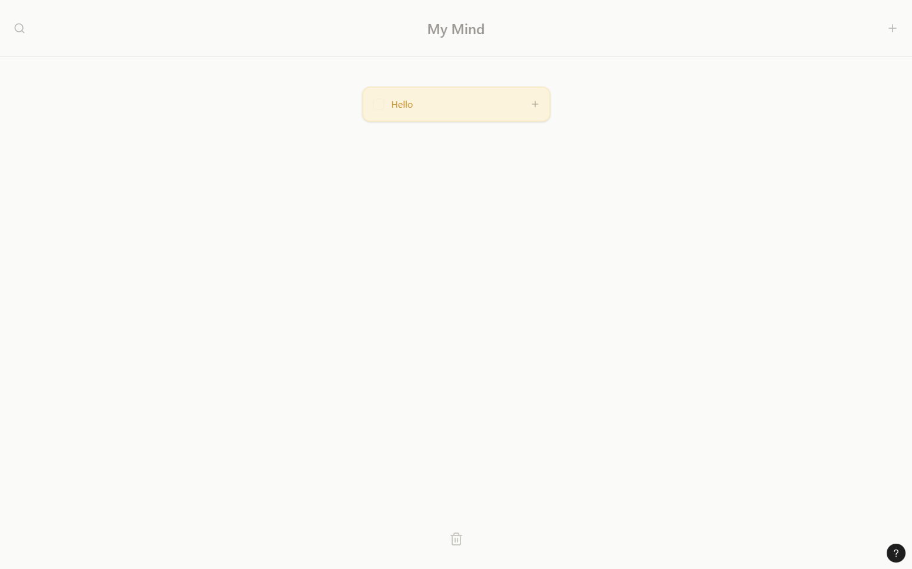
  
  I could make it just a little bit cooler by adding an animation to the trash can so you know when to let go of the task, and so I did, by asking it to 'Make the trash can open and close when we hover a task on top of it. And can the font be Josephin Sans? When we're trying to add a task can we make it say '...' instead of 'Task Name'. Lastly, can the colors come out from underneath the header, one by one in a cool animation, instead of in the header?', giving way to Version 0.5:

  
  
  I let the app rest for a bit and then, after a week goes by, I come back to it. By this point it has fully fulfilled my vision, much less so the assignment instructions, so I ask it to make a multi-user log in and use SQLAlchemy to do so by saying 'Okay now Imma need you to make a login page, making it available for multiplee users to use at the same time, but only each user can see only their own tasks. Speaking of their own tasks, for this log in functionality to work, then the tasks have to be saved, using SQLAlchemy, please do this, making it fully functional and retaining the same aesthetic, please.', which gives me Version 0.6:

  

  This still doesn't satisfy all of the assignment description, so I give Make the entire assignment description, which I will not copy-paste here, before asking it to 'make sure that it satisfies all of the following requirements from my assignment descriptions:', which it does, making Version 0.9:

  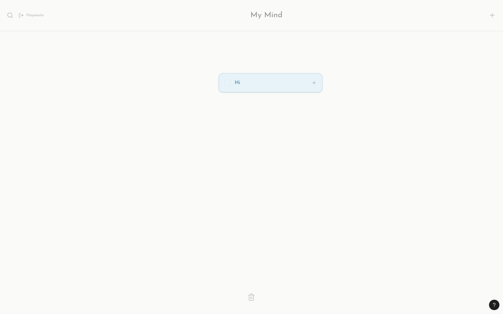
  
  Next, it screwed up a few things so I told it 'Can you remove the lists aspect? I don't need it or like it, so I think we're better off without it. Also, the 'Login' should be center aligned, additionally, the title should say '[the user's name]'s Mind' now instead of 'My Mind'. Moreover, when typing the name of a task, I don't want the '...' anymore, just a blinking pointer that indicates it should be written in. Sometimes the tasks delete themselves when I am dragging dropping them - please make it stop doing that, I just want it to drag and drop normally. And can I drag and drop subtasks and subsub tasks please? What else is there? Make minor edits as you see fit', which produced Version 0.8 here:

  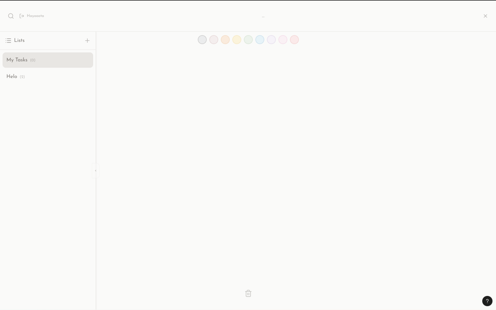
  
  Lastly, for development, I ask it to 'fix the Login button alignment, and I want sub tasks to be able to be dragged into other subtasks, and other permutations of that with subtasks. Lastly and most importantly, COMMENT EVERYTHING IN THE CODE VERY THOROUGHLY, and make a document called Documentation.md that details EVERYTHING and I mean EVERYTHING it took to create this assignment, including date and time stamps, ideas formed and implemented, versions and updates, everything everything everything an amazing process documentation should have', which lands us at Version 1.0 of My Mind:

  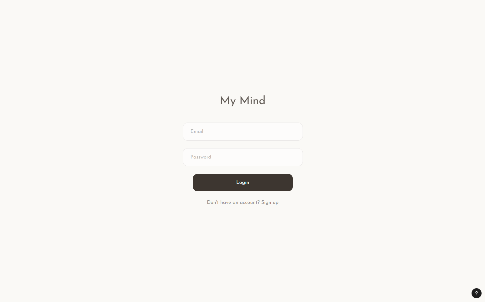
  
  ### Testing and Deployment

  After testing this out a BUNCH just by myself, even using it for a full day, I concluded that it is almost perfect - meaning it could use one more tweak, namely 'Now, for the final final version, like ever. Firstly, if you can fix the supabase to allow multiple users even when I publish the website via figma, that would be great (if not, forget about it, dont mess it up). Next, please restore the notion-esque colors, I dont like this new one - additionally, make the drag and drop and infinite scrolling as smooth as possible, please. Make sure to comment everything but make it simple, human understandable and most of all me-understandable, as I want to read it and understand what my code is doing, and I want my TA's and Professor to as well. More importantly, I need, NEED, need you to curate an entire document named Documentation.md that satisfies the assignment requirements of a process documentation that explicitly mentions exactly which prompts at what time and day created which version (cut out the version restotions, only the actual implementations). Detail everything, I mean EVERYTHING, everything, make this the best process documentation of the My Mind app that could ever be, because I know you can. A few last tweaks, you must restore the + symbol to add subtasks, as at some point it disappeared - and yeah, that's it!'.
  
  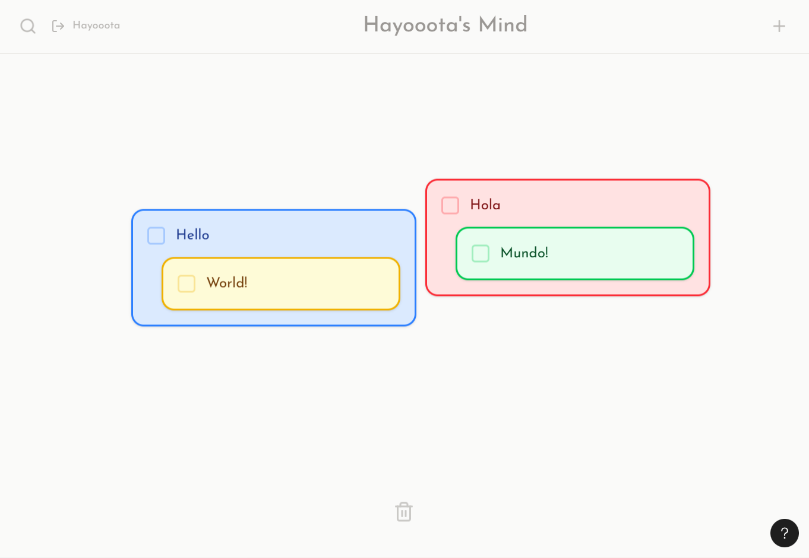
  
  And that is it, Version 1.1 of My Mind, that you can see now because I used Figma to deploy it to this link. Even better, you can run it by yourself, like so:

  ## Running the code

  Run `npm i` to install the dependencies.

  Run `npm run dev` to start the development server.

  ##AI Statement:
  
  A lot of AI was used in the creation of this assignment, as stated above.
  
